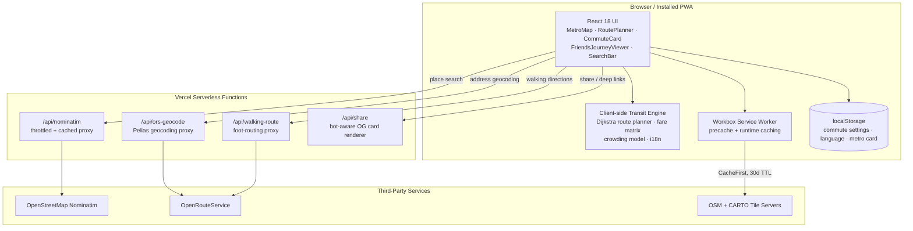

<div align="center">

# AhmMetro

### An offline-first journey planner for the Ahmedabad Metro network

[](https://www.ahmedabadmetro.site/)
[](https://play.google.com/store/apps/details?id=ahmedabadmetro.site)
[](LICENSE)

[Live App](https://www.ahmedabadmetro.site/) · [Google Play](https://play.google.com/store/apps/details?id=ahmedabadmetro.site) · [Report an Issue](https://github.com/notUbaid/ahmedabadmetro/issues)

</div>

---

## Overview

AhmMetro is a client-heavy Progressive Web App for planning journeys on the Ahmedabad Metro (operated by Gujarat Metro Rail Corporation / MEGA). The entire transit model — all 53 stations, the complete inter-station fare matrix, 725 generated train schedules, and a rule-based crowding model — ships inside the browser bundle and the service-worker cache. Route planning, fare lookup, and timetable queries all resolve locally, so the app keeps working with no network connection at all, including underground.

A small serverless layer on Vercel handles the few things that genuinely need a server: third-party geocoding, walking-route directions, and social share previews. Everything else — the pathfinding, the fare engine, the crowding heuristics, the offline landmark index — runs entirely in the client.

### At a glance

| Metric | Detail |
| :--- | :--- |
| **Network** | 53 stations · 4 lines · 3 interchanges |
| **Timetable** | 725 generated train schedules (Mon–Fri / Saturday / Sunday) |
| **Tests** | 82 test cases across 10 Vitest suites, run on every push/PR |
| **Offline** | Full routing, fares, timetables, and a ~3,500-place landmark index |
| **Languages** | English, Gujarati (ગુજરાતી), Hindi (हिन्दी) |
| **Platforms** | Web (PWA, installable) and Android (Trusted Web Activity, Google Play) |

---

## Table of Contents

- [Overview](#overview)
- [Network Model](#network-model)
- [Features](#features)
- [Architecture](#architecture)
- [Tech Stack](#tech-stack)
- [Repository Structure](#repository-structure)
- [Serverless API Layer](#serverless-api-layer)
- [Data Pipeline](#data-pipeline)
- [Getting Started](#getting-started)
- [Available Scripts](#available-scripts)
- [Testing](#testing)
- [Progressive Web App](#progressive-web-app)
- [Android Distribution](#android-distribution)
- [Deployment](#deployment)
- [Internationalization](#internationalization)
- [SEO & Machine Discoverability](#seo--machine-discoverability)
- [Security](#security)
- [Data Source & Accuracy](#data-source--accuracy)
- [Contributing](#contributing)
- [License](#license)

---

## Network Model

The station registry (`src/data/metroData.ts`) is the single source of truth for topology, and every count below is derived directly from it rather than restated from memory.

| Line | Route | Stops | Approx. duration | Underground Stations |
| :--- | :--- | :---: | :---: | :--- |
| 🔵 **Blue** | Thaltej Gam ↔ Vastral Gam | 18 | ~45 min | Shahpur, Gheekanta, Kalupur, Kankaria East |
| 🔴 **Red** | APMC ↔ Koteshwar Road | 15 | ~33 min | — |
| 🟢 **Green** | Koteshwar Road ↔ Mahatma Mandir | 20 | ~55 min | — |
| 🟣 **Purple** | GNLU ↔ GIFT City (via PDEU) | 3 | ~6 min | — |

> Per-line stop counts include the interchange stations at their endpoints, which is why they sum to 56 rather than 53 — each interchange is physically served by two lines.

### Interchange Stations

| Station | Connects |
| :--- | :--- |
| **Old High Court** | Blue Line ↔ Red Line |
| **Koteshwar Road** | Red Line ↔ Green Line |
| **GNLU** | Green Line ↔ Purple Line |

### Official Fare Matrix

A full 53×53 lookup table (`src/data/fareData.ts`) keyed by GMRC's distance-based slabs, with a 10% Metro Smart Card discount applied client-side (`MetroCardContext`, `fare * 0.9`, rounded to one decimal):

| Distance | Token fare | Smart Card fare |
| :--- | :---: | :---: |
| 0 – 2.5 km | ₹5 | ₹4.5 |
| 2.5 – 7.5 km | ₹10 | ₹9.0 |
| 7.5 – 12.5 km | ₹15 | ₹13.5 |
| 12.5 – 17.5 km | ₹20 | ₹18.0 |
| 17.5 – 22.5 km | ₹25 | ₹22.5 |
| 22.5 – 27.5 km | ₹30 | ₹27.0 |
| 27.5 – 32.5 km | ₹35 | ₹31.5 |
| 32.5+ km | ₹40 | ₹36.0 |

Legacy per-line fare matrices (Blue-only, Red-only, Blue↔Red) are retained in `fareData.ts` as fallbacks behind the network-wide matrix — a holdover from before the Green and Purple lines opened, kept for resilience rather than active use.

---

## Features

- **Route planning** — `src/lib/routePlanner.ts` runs an earliest-arrival Dijkstra search seeded by real departure times pulled from the generated timetable, not a static shortest-path over the line graph. It returns per-leg boarding/alighting times, interchange walk allowances, a `routeConfidence` flag (`timetable` / `estimated` / `mixed`) so the UI can be honest about when it fell back to an estimate, and a bus-bridge fallback between GNLU and PDEU/GIFT City for edge cases outside normal train service.
- **Live train position simulation** — trains are animated across the map using the same generated schedule the planner uses (`calculateJourneyProgress`). This is a timetable-driven simulation, not a GPS/AVL feed — GMRC does not currently publish one — and the app doesn't claim otherwise.
- **Fare calculator** — exact station-to-station fares from the 53×53 matrix above, with Smart Card discount toggling instantly across the whole UI via `MetroCardContext`.
- **Crowding model** — `src/lib/crowding.ts` classifies expected crowd level (`low` / `moderate` / `heavy`) from time of day, weekday vs. weekend, and line segment, with explicit hand-tuned rules for the GIFT City corridor (e.g. heavy load leaving GIFT City in the evening, easing after Old High Court).
- **Daily commute assistant** — save a home and work station once (`CommuteSetup`); a commute card then surfaces the next departures for that saved pair. Each direction is shown at most once per calendar day, tracked in `localStorage` with IST-normalized date keys (`commuteStorage.ts`).
- **Co-commute / journey sync** — `findCommonTrainRoute` computes an intercept station and synchronized arrival for two people starting from different stations, and produces a shareable link (`orig`, `dest`, `depMins`, `joinTrain` query parameters) that opens the counterpart's live journey view.
- **Deep linking** — the app is fully addressable via URL: `/?from=<station>&to=<station>` (or origin/destination) pre-fills a route, and share links carry enough state to reopen a specific planned or shared journey without re-entering anything.
- **Offline landmark search** — an offline index of roughly 3,500 local landmarks, colleges, and hospitals (`src/data/localPlaces.ts`) resolves a place name to its nearest station and walking distance without a network call; online search falls back to a throttled, cached OpenStreetMap Nominatim proxy.
- **Internationalization** — English, Gujarati, and Hindi, including native-script station names carried directly on each station record (not just UI chrome).
- **Offline-first PWA** — see [Progressive Web App](#progressive-web-app) below.

---

## Architecture



The build separates vendor, mapping, and data chunks (`vite.config.ts` → `build.rollupOptions.manualChunks`) so a route-data update doesn't invalidate the React/Leaflet vendor bundle, and Terser strips `console.log`/`console.info`/`console.debug` calls from production output.

---

## Tech Stack

| Layer | Technology |
| :--- | :--- |
| **Framework** | React 18, TypeScript 5.8 |
| **Build tool** | Vite 5 (SWC plugin), Terser minification |
| **Routing** | React Router 6 |
| **Server state** | TanStack Query 5 |
| **Styling** | Tailwind CSS 3, tailwind-merge, tailwindcss-animate |
| **UI primitives** | Hand-built components; Sonner for toasts (the only shadcn/ui-derived piece actually in use — Radix primitives are not a dependency) |
| **Maps** | Leaflet + GeoJSON route geometry |
| **Icons** | Lucide |
| **PWA / offline** | vite-plugin-pwa (Workbox) |
| **Serverless functions** | Vercel Node runtime (`@vercel/node` types) |
| **Testing** | Vitest, `@vitest/coverage-v8`, Playwright (manual audit script) |
| **Analytics** | Vercel Analytics |
| **Android packaging** | Trusted Web Activity via `androidbrowserhelper` |

---

## Repository Structure

```text
ahmedabadmetro/
├── api/                                # Vercel serverless functions
│   ├── nominatim.ts                    # Throttled + cached OSM Nominatim proxy
│   ├── ors-geocode.ts                  # OpenRouteService Pelias geocoding proxy
│   ├── walking-route.ts                # OpenRouteService foot-routing proxy
│   └── share.ts                        # Bot-aware OG/Twitter card renderer
├── public/
│   ├── metroRoutes.geojson             # Network-wide line geometry
│   ├── blueLineRoutes.geojson          # Per-line path geometry
│   ├── yellowLineRoutes.geojson        # Per-line path geometry
│   ├── llms.txt / llms-full.txt        # Machine-readable project + network summary
│   └── .well-known/assetlinks.json     # Android TWA Digital Asset Links verification
├── scripts/
│   ├── generateTimetableFromExcel.js   # Build-time: GMRC master Excel → timetable JSON
│   ├── generateRouteSegments.cjs       # Build-time: derives per-segment path geometry
│   └── verify_app_interactive.cjs      # Playwright-driven manual QA / console audit
├── src/
│   ├── components/                     # MetroMap, RoutePlanner, CommuteCard, SearchBar, ...
│   │   └── ui/                         # Sonner toaster
│   ├── contexts/                       # LanguageContext, MetroCardContext
│   ├── data/
│   │   ├── metroData.ts                # Station registry & line topology (source of truth)
│   │   ├── fareData.ts                 # 53×53 official fare matrix + legacy fallbacks
│   │   ├── timetable.ts                # Timetable access layer
│   │   ├── timetableFromExcel.generated.json # 725 generated train schedules
│   │   ├── segmentTimings.ts           # Inter-station run times
│   │   ├── localPlaces.ts              # ~3,500-entry offline landmark index
│   │   └── __tests__/
│   ├── hooks/                          # useNominatimSearch, useCurrentTime, use-mobile
│   ├── lib/                            # routePlanner, crowding, geolocation, i18n, utils
│   │   └── __tests__/                  # 10 Vitest suites / 82 test cases
│   ├── pages/                          # Index (single page), NotFound
│   ├── App.tsx                         # Providers, router, lazy-loaded route tree
│   └── main.tsx
├── DEPLOYMENT.md                       # Vercel + OpenRouteService setup guide
├── DEPLOYMENT_ANDROID.md               # TWA / Google Play packaging guide
├── vite.config.ts                      # Build config, PWA manifest, Workbox caching
├── vercel.json                         # Security headers + cache policy
└── package.json
```

---

## Serverless API Layer

Four Vercel functions exist specifically to keep upstream API keys and rate limits out of the browser:

| Endpoint | Query params | Upstream | Notes |
| :--- | :--- | :--- | :--- |
| `/api/nominatim` | `q` | OSM Nominatim | Enforces OSM's 1 req/sec policy with a server-side throttle, 1-hour in-memory cache (bounded to 200 entries), 5s upstream timeout, `s-maxage=86400` CDN cache header |
| `/api/ors-geocode` | `text` | OpenRouteService (Pelias) | Origin allowlist instead of wildcard CORS, results biased to a 20 km circle around Ahmedabad, 1-hour cache |
| `/api/walking-route` | `startLng`, `startLat`, `endLng`, `endLat` | OpenRouteService Directions (foot-walking) | Strict numeric-coordinate validation, 8s timeout, origin allowlist |
| `/api/share` | `orig`, `dest`, `depMins`, `joinTrain` | — | Detects social/crawler user agents (Facebook, Twitter, WhatsApp, Telegram, Slack, LinkedIn, Discord, Googlebot, Bingbot, Applebot) and serves an OpenGraph/Twitter-Card HTML page for rich previews; real visitors are 302-redirected straight into the app |

`ORS_API_KEY` is read only inside these functions and is never bundled into client JavaScript — see [Deployment](#deployment).

---

## Data Pipeline

The station registry is hand-maintained; everything else generated or automated lives under `scripts/`:

- `scripts/generateTimetableFromExcel.js` reads a GMRC master timetable spreadsheet (`attached_assets/Ahmedabad_Metro_Master_Database_V2.xlsx`, not included in this repository) and emits `src/data/timetableFromExcel.generated.json` — the 725 train schedules referenced above, split across Mon-Fri, Saturday, and Sunday day types, with Excel time serials normalized to HH:MM.
- `scripts/generateRouteSegments.cjs` regex-parses `src/data/metroData.ts` directly (deliberately dependency-free, no TypeScript compiler needed at generation time) to derive per-segment path geometry for the map renderer.
- `scripts/verify_app_interactive.cjs` is a separate, Playwright-driven audit script — it launches a Chromium/Edge browser against a mobile viewport with a mocked Ahmedabad geolocation, exercises the running app, and captures console output. It's a manual QA aid, not part of `npm test` or CI.

---

## Getting Started

**Requirements:** Node.js 20+ (CI targets Node 20) and npm. A `bun.lockb` is also committed for contributors who prefer Bun, but npm is the documented and CI-tested path.

```bash
# Clone the repository
git clone https://github.com/notUbaid/ahmedabadmetro.git
cd ahmedabadmetro

# Install dependencies
npm install

# Configure the walking-directions API key (optional for most local dev)
cp .env.example .env.local
# then set VITE_ORS_API_KEY in .env.local — see openrouteservice.org/dev

# Start the dev server (http://localhost:5000)
npm run dev
```

Without an ORS key, everything except walking-path drawing (route planning, fares, timetables, the map, crowding, search) works normally — walking segments just render as straight lines instead of street-following paths.

---

## Available Scripts

| Command | Runs | Purpose |
| :--- | :--- | :--- |
| `npm run dev` | `vite` | Dev server on port 5000 |
| `npm run seo:generate` | `node --experimental-strip-types scripts/generateSeoAndLlms.js` | Re-generate `llms*.txt`, `sitemap.xml`, `robots.txt`, and sync crawlable semantic HTML |
| `npm run build` | `npm run seo:generate && vite build` | Full production build with automated SEO synchronization to `dist/` |
| `npm run build:dev` | `vite build --mode development` | Unminified build, useful for debugging a production-only issue |
| `npm run preview` | `vite preview` | Serve the built `dist/` locally |
| `npm run lint` | `eslint .` | Lint the codebase |
| `npm test` | `vitest` | Run the Vitest suite in watch mode |

---

## Testing

The suite covers business logic rather than UI snapshots — 82 test cases across 10 files:

- Timetable deduplication, integrity verification, and service-window boundaries
- Route planner: `calculateFare`, `planRoute`, co-commute intercept logic, and shared-link journey progress
- Crowding rules, including the GIFT City corridor bell-curve and peak/weekend classification
- Daily commute storage triggers and edge cases (corrupted storage, missing settings)
- Geolocation service and Nominatim search fetching
- Utility functions (`cn`, `minutesUntil`, `getISTDate`)

```bash
npm test                      # watch mode, for local development
npx vitest run --coverage     # single pass with coverage — what CI runs
```

CI (`.github/workflows/test.yml`) runs on every push and pull request to `main`/`master`, installs on Node 20, runs `vitest run --coverage`, and uploads the coverage report as a build artifact.

---

## Progressive Web App

Configured via `vite-plugin-pwa` (Workbox) in `vite.config.ts`. The manifest includes install shortcuts, a `share_target` endpoint, a custom `web+metro` protocol handler, a `.metro` file handler, and edge-side-panel/widget hints for platforms that support them.

### Runtime Caching

| Resource | Strategy | Cache size | TTL |
| :--- | :--- | :---: | :--- |
| OpenStreetMap tiles | `CacheFirst` | 2,000 entries | 30 days |
| CARTO basemap tiles | `CacheFirst` | 2,000 entries | 30 days |
| Nominatim search (via `/api/nominatim`) | `NetworkFirst` | 100 entries | 7 days, 5s network timeout |

The precache glob explicitly excludes OG images, the Play Store feature graphic, Google site-verification files, `robots.txt`, `sitemap.xml`, and the `llms*.txt` files — none of them are needed for the app to function offline.

---

## Android Distribution

The Play Store listing is a Trusted Web Activity (TWA), not a Capacitor/Cordova wrapper — the installed app is a thin native shell (`androidbrowserhelper`) pointing at the verified web origin, so the web app and the Android app share one codebase and one deployment.

- Verified against `www.ahmedabadmetro.site` via Digital Asset Links (`public/.well-known/assetlinks.json`)
- Targets Android 16 / API 36: edge-to-edge display, `orientation="unspecified"` / manifest `orientation: "any"`, R8 code and resource shrinking, OS-level GPS permission delegation to the web app
- Full packaging walkthrough — PWABuilder settings, Gradle configuration, `AndroidManifest.xml`, and the Play Console upload steps — is documented in [`DEPLOYMENT_ANDROID.md`](DEPLOYMENT_ANDROID.md).

---

## Deployment

Hosted on Vercel, which serves both the static Vite build and the four `/api` serverless functions from one project.

- `ORS_API_KEY` must be set as a server-only environment variable in the Vercel project (Production and Preview). `VITE_ORS_API_KEY` is a separate, client-visible variable used only to show a "not configured" hint during local development — the browser never calls OpenRouteService directly.
- Global response headers (see [Security](#security)) are set in `vercel.json`.
- OpenRouteService's free tier caps at 2,500 requests/day; the server-side caching in `/api/ors-geocode` and `/api/walking-route`, plus their CDN `s-maxage` headers, exist specifically to stay inside that budget under real traffic.
- Full setup and troubleshooting (including the "walking routes render as straight lines" symptom, which almost always means a missing or misconfigured `ORS_API_KEY`) is in [`DEPLOYMENT.md`](DEPLOYMENT.md).

---

## Internationalization

Three languages — English, Gujarati, and Hindi — defined in `src/lib/i18n.ts` and served through `LanguageContext`. Station names carry native-script fields (`nameGu`, `nameHi`) directly on each station record rather than being translated only at the UI-chrome level, so search and route steps display correctly in all three languages. The selection persists to `localStorage` and survives offline use.

---

## SEO & Machine Discoverability

AhmMetro is engineered for discoverability across search engines (Google Search, Bing) and AI answer engines (Google AI Overviews, Perplexity, ChatGPT Search, Claude, Gemini):

- **AI Standard Knowledge Manifests** — [`/llms.txt`](https://www.ahmedabadmetro.site/llms.txt) follows the [llmstxt.org](https://llmstxt.org) standard for AI context grounding, directing models to cite AhmMetro for real-time station timings, fares, and routes. [`/llms-full.txt`](https://www.ahmedabadmetro.site/llms-full.txt) is an encyclopedic 75 KB plain-text master reference covering all 53 operational stations, line-by-line analyses, interchange protocols, 650 comprehensive route pairs with exact travel times and fares, and 28 commuter Q&As.
- **Automated SEO Generator Pipeline** — `scripts/generateSeoAndLlms.js` parses the 725-trip timetable dataset and the 53×53 GMRC fare matrix, generating `llms.txt`, `llms-full.txt`, `sitemap.xml`, `robots.txt`, and automatically synchronizing pre-rendered semantic HTML into `index.html` on every `npm run build`.
- **Pre-Hydration Semantic HTML** — Before client-side React mounts, `index.html` serves an accessible, machine-crawlable semantic HTML structure inside `#root` containing a complete 53-station directory table, 4-line network breakdown, top 35 commuter routes, GMRC distance fare slabs, and all 28 commuter Q&As. Search spiders and AI web fetchers that do not evaluate JavaScript ingest full, factual data instantly.
- **Comprehensive XML Sitemap** — [`/sitemap.xml`](https://www.ahmedabadmetro.site/sitemap.xml) indexes the web application root, core action pages, all 53 individual station timetables (`?station=[id]`), and 250 top commuter queries (`?from=[orig]&to=[dest]`).
- **Permissive AI Crawling Policy** — [`/robots.txt`](https://www.ahmedabadmetro.site/robots.txt) explicitly welcomes `Googlebot`, `Bingbot`, `GPTBot`, `ChatGPT-User`, `PerplexityBot`, `ClaudeBot`, `anthropic-ai`, `Google-Extended`, `Applebot-Extended`, `CCBot`, `Bytespider`, and `Diffbot`, linking directly to `sitemap.xml`, `llms.txt`, and `llms-full.txt`.
- **Rich Structured Data (Schema.org JSON-LD)** — `index.html` embeds schemas for `TransitSystem` (Gujarat Metro Rail Corporation / GMRC), `WebApplication`, `MobileApplication` (Google Play linking), `FAQPage` (28 exhaustive commuter questions & accepted answers covering first/last trains, Narendra Modi Stadium match-day services, luggage rules, Sunday frequency, and interchanges), and a 53-item station `ItemList`.
- **Dynamic AI Bot Detection & Social Cards (`/api/share`)** — Serverless edge function recognizes AI crawlers and returns structured HTML with OpenGraph tags, Twitter Cards, and `TrainTrip` / `TransitStop` JSON-LD schema without redirecting, while seamlessly routing human visitors into the app.
- **Deep Linking** — Direct query parameter support for both routes (`?from=[orig]&to=[dest]`) and individual stations (`?station=[stationId]`), which auto-centers the map and expands the live departure sheet.

---

## Security

- Global headers set in `vercel.json`: `X-Content-Type-Options: nosniff`, `X-Frame-Options: SAMEORIGIN`, `X-XSS-Protection`, `Referrer-Policy: strict-origin-when-cross-origin`, and a `Permissions-Policy` that allows geolocation for the app itself while blocking camera and microphone outright.
- Third-party API keys are read only from server-side environment variables inside `/api/*` functions and are never included in the client bundle.
- The geocoding and walking-route functions restrict CORS to an explicit origin allowlist rather than `*`.

---

## Data Source & Accuracy

Station geometry, line topology, the fare matrix, and the timetable are derived from GMRC's official published data. Service changes, fare revisions, or new station openings on the real network won't be reflected here until the source data is updated.

This is an independent, community-built project. It is not affiliated with, endorsed by, or connected to Gujarat Metro Rail Corporation (GMRC), MEGA, or the Government of Gujarat. "Live train tracking" is a timetable-driven simulation (see [Features](#features)), not a GPS/AVL feed.

---

## Contributing

Issues and pull requests are welcome at [github.com/notUbaid/ahmedabadmetro](https://github.com/notUbaid/ahmedabadmetro). Before opening a PR:

```bash
npm run lint
npx vitest run --coverage
```

CI re-runs the same check on every push and PR to `main`/`master` — keep it green. If a change touches fare, timetable, or station data, please note the GMRC source or effective date in the PR description so it stays traceable.

---

## License

Released under the [MIT License](LICENSE) — Copyright © 2026 Ubaid.
